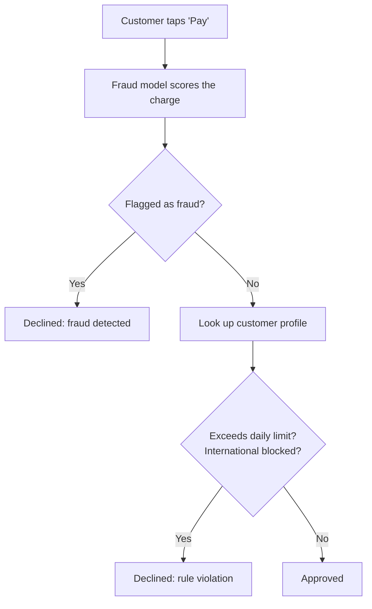

# What Happens in the milliseconds after you tap pay

You're standing at the register. You tap your card. A tiny spinner appears—maybe half a second, maybe less, and then it says **Approved**. Or it doesn't.

During that time, something had to decide whether this charge looks like you, or like someone who stole your card number in a data breach six months ago. It had to know things about you such as your spending patterns, your daily limit, whether you even allow purchases from other countries. And it had to do all of that fast enough that you don't notice it happened.

This post is about what that "something" looks like when you build it on Databricks. We'll walk through **retail-app**, a sample application (FastAPI backend, React frontend, built with [apx](https://docs.databricks.com/en/dev-tools/databricks-apps/app-development.html)) that puts three platform capabilities together:

- **Model Serving with route optimization** — a faster network path to your deployed model
- **Lakebase** — managed Postgres for the profile and feature data the model needs at prediction time
- **Lakebase Autoscaling** — so the database scales with demand instead of becoming the new bottleneck

The [full repo is on GitHub](#)—you can fork it, deploy it to your workspace, and tap "pay" yourself.

---

## The flow: what actually happens on a transaction

Before we look at code, here's the plain story of a single payment. Two checks run in sequence: an AI model scores the charge, then the app checks your profile rules. Either one can decline the transaction.




That's it. The model runs first because we want its latency numbers regardless of the outcome. Then the profile lookup—daily spending cap, international transaction toggle, country of residence—feeds a handful of if-statements. The response includes timing for every step so you can see exactly where the milliseconds went.

**Updating your profile** (changing your daily limit, toggling international transactions) is a separate action. You save changes to the database, and the *next* payment picks them up—no redeployment, no cache invalidation.

---

## Route optimization: why the network path matters

When a model is deployed behind Databricks Model Serving, there's a network hop between your application and the inference container. For batch workloads, a few extra milliseconds per request is irrelevant. For a checkout experience, it's everything.

[Route optimization](https://docs.databricks.com/aws/en/machine-learning/model-serving/route-optimization) shortens that network path. You enable it when you create the endpoint, and you query through the **data-plane** flow using OAuth—not personal access tokens. The result is lower latency and higher throughput for the same compute, which is exactly what an interactive fraud-scoring use case needs.

In the sample app, the endpoint is called `fraud-detection-lakebase`. Here's the constant and the function that calls it:

```python
# src/retail_app/backend/router.py

FRAUD_ENDPOINT_NAME = "fraud-detection-lakebase"

async def _check_fraud(
    ws: WorkspaceClient, txn: TransactionIn
) -> dict[str, Any]:
    payload = [
        {
            "user": txn.user_id,
            "country": txn.country,
            "country_code": txn.country_code,
            "amount": txn.amount,
            "credit_card": _format_credit_card(txn.credit_card_number),
            "currency": txn.currency,
        }
    ]

    start = time.perf_counter()
    response = await asyncio.to_thread(
        ws.serving_endpoints_data_plane.query,
        name=FRAUD_ENDPOINT_NAME,
        dataframe_records=payload,
    )
    model_call_ms = (time.perf_counter() - start) * 1000
```

A few things to notice:

- `**serving_endpoints_data_plane.query**` — This is the data-plane query path, which is what route optimization uses. The Databricks SDK handles the OAuth token exchange under the hood.
- `**asyncio.to_thread**` — The SDK's query method is synchronous. Wrapping it in `to_thread` keeps the FastAPI event loop free while the model runs.
- `**dataframe_records**` — The payload is a list of dictionaries (one per row). For fraud scoring, we send one transaction at a time.

The model itself returns `fraud_probability`, `fraud_flag`, and—crucially—its own internal timing: `lookup_ms` (how long the feature lookup inside the model container took), `inference_ms` (CatBoost prediction), and `total_ms`. The backend maps these through so the frontend can show a latency waterfall:

```python
# src/retail_app/backend/router.py

prediction = predictions[0]
return {
    "fraud_probability": prediction["fraud_probability"],
    "fraud_flag": prediction["fraud_flag"],
    "model_call_ms": model_call_ms,
    "model_lookup_ms": prediction.get("lookup_ms"),
    "model_inference_ms": prediction.get("inference_ms"),
    "model_total_ms": prediction.get("total_ms"),
}
```

So when you see "Model: 45ms (lookup: 8ms, inference: 3ms)" in the UI, those aren't made-up numbers—they're measured at each layer and stitched together in a single response.

For more on setting this up: [Route optimization](https://docs.databricks.com/aws/en/machine-learning/model-serving/route-optimization) · [Querying route-optimized endpoints](https://docs.databricks.com/aws/en/machine-learning/model-serving/query-route-optimization).

---

## Lakebase: Postgres for the data the model needs

The fraud model doesn't just look at the transaction in isolation. It looks up the customer's historical features—average transaction amount, cross-border ratio, chargeback rate, velocity over the past 24 hours—using the first six digits of the credit card (the BIN) as the lookup key. Those features live in a [Lakebase](https://docs.databricks.com/aws/en/oltp) Postgres table called `customer_features`.

This is the same table the *backend* reads from for profile data (name, daily limit, international toggle). One table, two readers: the model container reads features for inference, the FastAPI app reads profile fields for business rules.

Here's the backend's profile read:

```python
# src/retail_app/backend/postgres.py

TABLE = "customer_features"

def get_profile(user_id: str) -> dict[str, Any] | None:
    """Read a user profile from customer_features."""
    try:
        pool = _ensure_pool()
        conn = pool.getconn()
        try:
            with conn.cursor(cursor_factory=psycopg2.extras.RealDictCursor) as cur:
                cur.execute(
                    f"SELECT * FROM {TABLE} WHERE user_id = %s",
                    (user_id,),
                )
                row = cur.fetchone()
                if row is None:
                    return None
                return _to_dict(row)
        finally:
            pool.putconn(conn)
    except Exception:
        logger.exception("Failed to read profile from Postgres")
        return None
```

Parameterized query, connection borrowed from the pool, returned in a `finally` block. Simple, but correct—which matters when this runs on every transaction.

Profile *writes* work the same way. When a user changes their daily limit in the UI, `update_profile` builds a dynamic `UPDATE` from an allowlist of editable columns:

```python
# src/retail_app/backend/postgres.py

def update_profile(user_id: str, data: dict[str, Any]) -> bool:
    profile_fields = [
        "full_name", "email", "phone", "country_of_residence",
        "preferred_currency", "allow_international_transactions",
        "daily_limit", "enable_notifications",
    ]

    updates = []
    values: list[Any] = []
    for field in profile_fields:
        if field in data:
            updates.append(f"{field} = %s")
            values.append(data[field])

    if not updates:
        return False

    values.append(user_id)
    set_clause = ", ".join(updates)

    try:
        pool = _ensure_pool()
        conn = pool.getconn()
        try:
            conn.autocommit = True
            with conn.cursor() as cur:
                cur.execute(
                    f"UPDATE {TABLE} SET {set_clause} WHERE user_id = %s",
                    values,
                )
                return cur.rowcount > 0
        finally:
            pool.putconn(conn)
    except Exception:
        logger.exception("Failed to update profile")
        return False
```

Only fields in the allowlist get written. The client can't inject arbitrary column names. `autocommit = True` means the write is immediately visible—so the next transaction sees the new limit without waiting for a batch flush.

---

## Connection pooling and OAuth token rotation

Lakebase authenticates via OAuth: the app exchanges service principal credentials for an access token, then uses the **client ID as the Postgres username** and the **token as the password**. This is standard for Databricks-managed Postgres—no long-lived database passwords.

The connection pool is a `psycopg2.pool.ThreadedConnectionPool` with 3–10 connections. Every database operation borrows a connection with `getconn()` and returns it with `putconn()` in a `finally` block.

The interesting part is what happens when the OAuth token expires. You can't just keep using the old password on pooled connections—they'd fail on the next query. So `_ensure_pool` checks whether the token has changed, and if it has, builds a fresh pool:

```python
# src/retail_app/backend/postgres.py

def _ensure_pool() -> psycopg2.pool.ThreadedConnectionPool:
    global _pool, _pool_token

    client_id, _ = _ensure_credentials()
    current_token = _get_oauth_token()

    # Fast path: pool exists and token hasn't changed
    if _pool is not None and _pool_token == current_token:
        return _pool

    with _pool_lock:
        # Double-check after acquiring lock
        if _pool is not None and _pool_token == current_token:
            return _pool

        old_pool = _pool

        _pool = psycopg2.pool.ThreadedConnectionPool(
            minconn=3,
            maxconn=10,
            host=PG_HOST,
            port=PG_PORT,
            dbname=PG_DB,
            user=client_id,
            password=current_token,
            sslmode="require",
            connect_timeout=10,
        )
        _pool_token = current_token

        # Close old pool after a delay so in-flight queries finish
        if old_pool is not None:
            threading.Timer(30.0, _close_pool, [old_pool]).start()

        return _pool
```

The double-check locking pattern prevents two threads from rebuilding the pool simultaneously. The 30-second timer on closing the old pool gives in-flight queries time to finish before their connections disappear. It's a small detail, but it's the difference between "works in a demo" and "works under load."

---

## The model's side: feature lookup inside the container

The fraud model itself—deployed as an MLflow pyfunc—does its *own* Lakebase lookup at prediction time. It extracts the card BIN, queries `customer_features`, assembles a feature vector, and runs CatBoost inference. Each step is timed:

```python
# model_training/fraud_model.py (inside FraudDetectionModel.predict)

card_bin = self._extract_card_bin(row["credit_card"])

t_lookup_start = time.perf_counter()
features = self._lookup_customer_features(card_bin)
lookup_ms = (time.perf_counter() - t_lookup_start) * 1000

# ... assemble feature vector from looked-up data ...

t_infer_start = time.perf_counter()
fraud_prob = float(self.model.predict_proba(feature_vector)[0, 1])
inference_ms = (time.perf_counter() - t_infer_start) * 1000
```

The model container maintains its own `ThreadedConnectionPool` to Lakebase (the `LakebaseConnectionPool` class in `fraud_model.py`), with background token refresh so the pool stays valid across long-running serving instances. This is the same pattern as the backend—pool + OAuth rotation—but running inside the model container rather than the FastAPI process.

The `lookup_ms` and `inference_ms` values flow back through the serving response, through the backend, and into the frontend. That's how you get end-to-end visibility: the model reports its internal timing, the backend adds its own wall-clock measurement, and the user sees all of it.

---

## Business rules: the profile check

After the model scores the transaction, the backend reads the customer's profile from Lakebase and applies two rules:

```python
# src/retail_app/backend/router.py

profile = get_profile(txn.user_id)

if profile is not None:
    daily_limit = float(profile.get("daily_limit", 50000))
    allow_intl = profile.get("allow_international_transactions", True)

    # Rule 1: amount exceeds daily limit
    if txn.amount > daily_limit:
        status = TransactionStatus.DECLINED
        decline_reason = (
            f"Amount ${txn.amount:,.0f} exceeds your daily limit of "
            f"${daily_limit:,.0f}. Update your profile to increase it."
        )

    # Rule 2: international transaction not allowed
    if not allow_intl and txn.country_code != user_country:
        status = TransactionStatus.DECLINED
        decline_reason = (
            f"International transactions are disabled on your account."
        )
```

These rules can *override* a model approval—a transaction the model thinks is fine can still be declined because the user set a $500 daily cap. That's intentional. The model handles statistical risk; the profile handles user preferences. Both read from the same Lakebase table, but they serve different purposes.

The time spent on the profile lookup and rule evaluation is tracked as `business_logic_ms` and returned alongside the model timing:

```python
business_logic_ms = round((time.perf_counter() - biz_start) * 1000, 2)
latency.business_logic_ms = business_logic_ms
```

---

## Lakebase Autoscaling: handling demand

In production, your Postgres instance needs to handle both the model container's feature lookups *and* the backend's profile reads—potentially many of each per second during peak hours. [Lakebase Autoscaling](https://docs.databricks.com/aws/en/oltp/autoscaling) adjusts compute within a configured min/max range so you're not paying for peak capacity at 3 AM, but you're also not dropping queries at noon.

This matters because optimizing the serving layer (route optimization for low-latency inference) only helps if the database behind it can keep up. If the model's feature lookup blocks on a saturated Postgres connection, you've moved the bottleneck rather than removing it. Autoscaling is how you avoid that.

---

## Putting it together

Here's the full latency picture for a single transaction:


| Measurement          | What it captures                            | Where it's measured      |
| -------------------- | ------------------------------------------- | ------------------------ |
| `model_call_ms`      | Wall-clock time for the entire serving call | Backend (`router.py`)    |
| `model_lookup_ms`    | Feature lookup inside the model container   | Model (`fraud_model.py`) |
| `model_inference_ms` | CatBoost prediction time                    | Model (`fraud_model.py`) |
| `model_total_ms`     | Total time inside the model container       | Model (`fraud_model.py`) |
| `business_logic_ms`  | Profile read + rule evaluation              | Backend (`router.py`)    |
| `backend_total_ms`   | Everything from request to response         | Backend (`router.py`)    |


The gap between `model_total_ms` and `model_call_ms` is network overhead—and that's exactly where route optimization helps. The gap between `backend_total_ms` and `model_call_ms + business_logic_ms` is framework overhead (serialization, routing, etc.).

When you run the app and submit a transaction, the UI shows these numbers. That makes it easy to demonstrate the difference route optimization makes, or to show that a Lakebase feature lookup adds single-digit milliseconds rather than the hundreds you might expect from a cold database connection.

---

## Try it yourself

The app is built with [apx](https://docs.databricks.com/en/dev-tools/databricks-apps/app-development.html) (Databricks' toolkit for full-stack apps). To run locally:

```bash
apx dev start     # starts FastAPI + React dev servers
apx dev logs      # tail the backend logs
```

To deploy to your workspace:

```bash
apx build
databricks bundle deploy -t dev
```

The key files:

- `src/retail_app/backend/router.py` — Transaction endpoint, fraud check, business rules
- `src/retail_app/backend/postgres.py` — Lakebase connection pool, profile CRUD
- `model_training/fraud_model.py` — MLflow pyfunc with feature lookup and CatBoost
- `app.yml` — Deployment config (uvicorn entrypoint, environment variables)

---

## Related documentation

- [Model Serving: Route optimization](https://docs.databricks.com/aws/en/machine-learning/model-serving/route-optimization)
- [Querying route-optimized serving endpoints](https://docs.databricks.com/aws/en/machine-learning/model-serving/query-route-optimization)
- [Optimize serving endpoints for production](https://docs.databricks.com/aws/en/machine-learning/model-serving/production-optimization)
- [Lakebase (OLTP)](https://docs.databricks.com/aws/en/oltp)
- [Lakebase Autoscaling](https://docs.databricks.com/aws/en/oltp/autoscaling)
- [Databricks Apps](https://docs.databricks.com/en/dev-tools/databricks-apps/app-development.html)
- [MLflow code-based models](https://mlflow.org/docs/latest/models.html#python-function-python-model)

